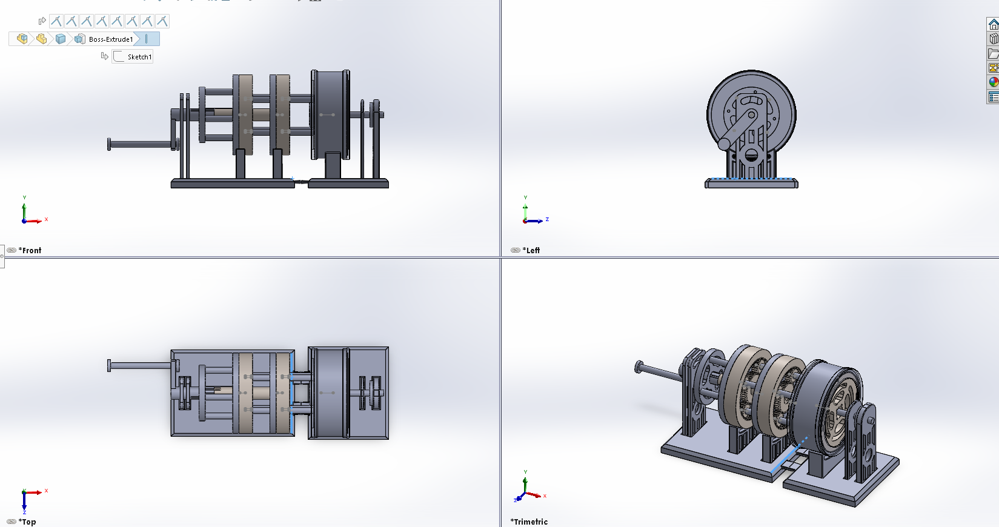

# Ethan Sun — Portfolio

Links: [Resume](pdf/resume.pdf) · [LinkedIn](https://linkedin.com/in/ethsun-ubc882) · [Email](mailto:EthanSun882@gmail.com)

## Planetary Gearbox (3-speed)

- Project: 3-Speed planetary gear box with OD
- Objective: Learn tolerancing, backlash controls, and selectable gear ratios. 
- Approach: Module 1.25 gears, identical planets, printed prototypes in PLA/ PETG. Manual Clutches to fix certain members to change gear ratios. Effective remodel of a traditional Simpsons Gear. Ran clearance testing, bearing bores referencing to positional tolerances, section views and full mechanical assemblies. 
- Sanity Checks: Math behind gear ratios, such as when fixing different components 
- Results: Smooth Hand driven Exploded gear box, predictable assemblies, engineering drawings with selective tolerancing points. 
  [Engineering Drawings](images/Input_Support.png)

## VEX Drivetrain

- Role: lead builder; faster pit fixes

## Tolerance Study

- Press ≈ +0.10 mm, slip ≈ +0.20 mm (PLA)
